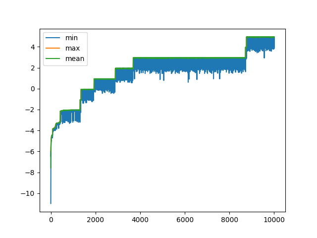
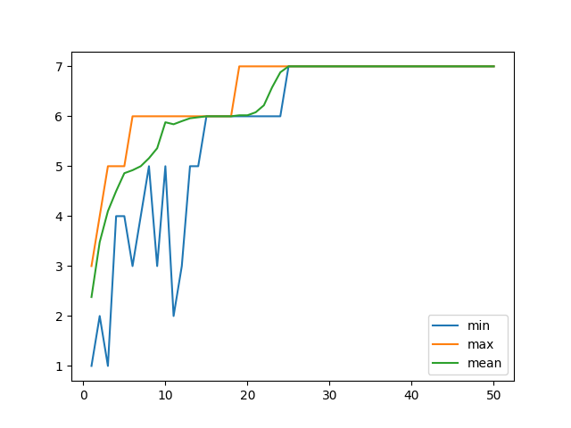
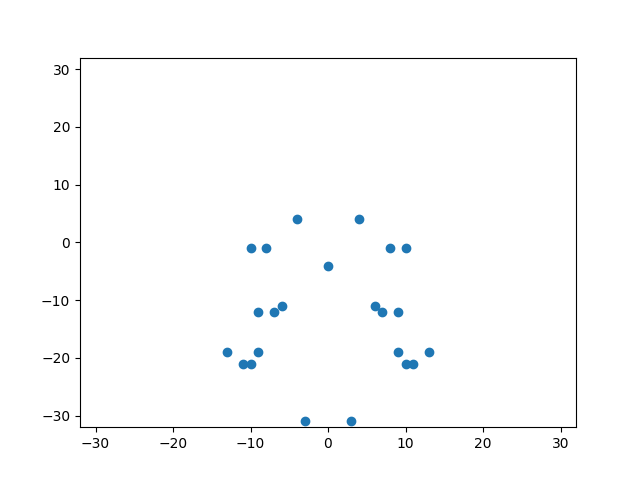
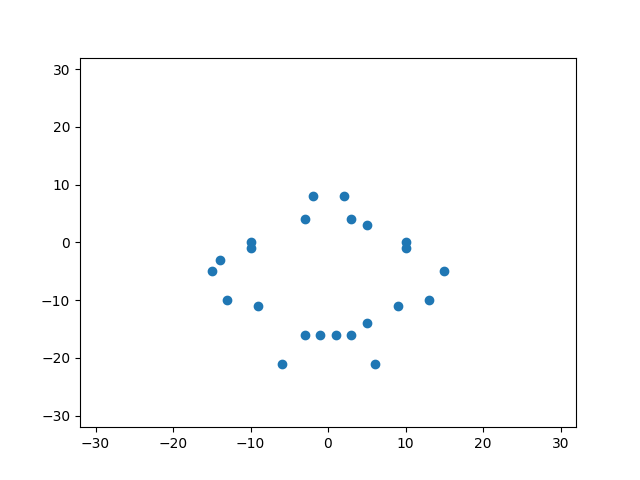
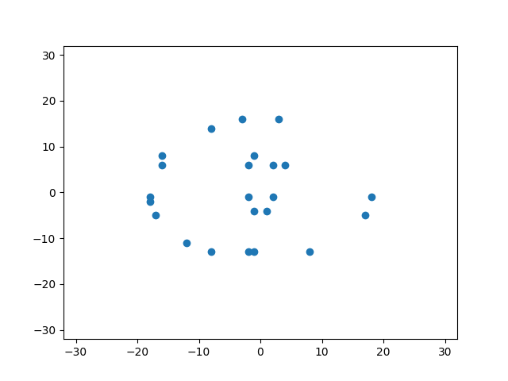

# コード解説

### 遺伝子表現の仕方

進化計算をするためには遺伝子表現が必要である。今回は点の配置を考える際に(x, y)座標を遺伝子表現にする必要がある。

今回はx, yは整数型とし、遺伝子表現の方法は符号付き二進数とした。計算時間の兼ね合いにより, xとyは-32から31の値を取ることにした。

### 評価関数の決め方

進化計算のためには評価関数を決める必要がある。この評価関数次第で実際の点の配置にかなり影響を及ぼすので慎重に決めた。色々な点配置の美しさを考えて行った時に, 左右対称であることが大方の点の配置に当てはまるため, 左右対称であることを美しさの基準として採用し, 左右対称であることを目指して最適化を行った。(点対称の点の配置は考えなかった。)

一つ目の評価基準は左右対称であることである。この時既に見た同じ左右対称点の配置は得点に含めないことにした。

二つ目の評価基準は互いの点が適度に離れていることである。この評価基準を追加した理由は、左右対称であることのみを評価基準にして実験した時に, 互いの点が近づきすぎていてあまり綺麗に見えなかった点の配置が現れたためである。例えば互いの点が20程度離れていて欲しい時は, 以下の損失を与えることとした。

ただし以下の$x_{i}, x_{j}$は二次元ベクトルである。

$$
\|20-\|x_{i}-x_{j}\|_{2}\|_{2}^{2}, \, where \,\, i \, \ne \, j
$$

よって, 全体の評価関数は, 二次元座標$x_{i}, x_{j}$が左右対称である時に1を取るような関数を$f(x_{i}, x_{j})$とすると

$$
\sum_{i \ne j}f(x_{i}, x_{j}) - \lambda \sum_{i \ne j} \|20-\|x_{i}-x_{j}\|_{2}\|_{2}^{2}
$$

となる。ただし, $\lambda$は$\sum_{i \ne j}f(x_{i}, x_{j})$のオーダーに合わせるように設定する。今回は$\lambda = \dfrac{1}{20^2}$とした。

その他の設定は課題5の進化計算と同じである。今回はdarwinとlamarckの2つで実験を行った。

# Result

darwinを10000世代回した結果とlamarckを50世代回した結果は以下の通りである。
lamarckの遺伝的アルゴリズムはかなり計算量が重く, 50世代で6時間もかかった

### darwin

### lamarck

学習の中で, 最も良く点が配置された画像を記す。この時のスコアは7.12, アルゴリズムはlamarckであった。

点同士を線で繋いだら何かのキャラクターになりそうです。

その他の点の配置を見て上の点の配置が最も綺麗な点の配置であることを実感してもらおうと思う。

lamarck スコア6.9

darwin

遺伝子表現が非常に長くなってしまったためか, 一度局所解にハマると抜け出すことが困難となってしまっていることが確認できた。
また, darwinアルゴリズムよりもlamarckの方が収束性能はよかった。
他にも, 点対称であることなどを条件に含めたが, 結局左右対称であることと, 点同士の距離を一定以上保つように訓練した方が良い結果が得られた。
